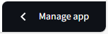
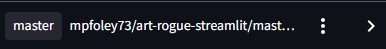

ArtRogue Streamlit
==================

This project is a port of the ArtRogue Shiny app ([shinyapps.io](https://mpfoley73.shinyapps.io/art-rogue/), [github](https://github.com/mpfoley73/art-rogue)) to Streamlit ([streamlit.io/cloud](https://art-rogue.streamlit.app/), [github](https://github.com/mpfoley73/art-rogue-streamlit)). 

## How to run

Initially, create a virtual env and install dependencies from `requirements.txt`. To activate the virtual env, you'll need permissions.

```powershell
Set-ExecutionPolicy -ExecutionPolicy RemoteSigned -Scope CurrentUser
```

Then create and activate the virtual env and install dependencies:

```powershell
python -m venv .venv; .\.venv\Scripts\Activate.ps1; pip install -r requirements.txt
```

You should notice that you have a new prompt prefix like `(.venv)`.<br>
Before: `PS C:\Users\mpfol\OneDrive\Documents\GitHub\art-rogue-streamlit>`  
After: `(.venv) PS C:\Users\mpfol\OneDrive\Documents\GitHub\art-rogue-streamlit>`

Going forward, whenever you open a new terminal to work on this project, just run:

```powershell
.venv\Scripts\Activate.ps1
```

Then you can run the app locally with:

```powershell
streamlit run app.py
```

## Deployment

This app is hosted on Streamlit Community Cloud.

- Create an account at [https://streamlit.io/cloud](https://streamlit.io/cloud).
- Link your account to your GitHub repo.

Files:
- `app.py` — main Streamlit app
- `utils.py` — helpers to query MET and CMA APIs

## Chat / OpenAI

This prototype includes a simple chat panel that uses OpenAI's API to generate text. To use it set an environment variable `OPENAI_API_KEY` with your OpenAI API key before running Streamlit. If the key or SDK aren't available, the chat shows a helpful message instead of streaming.

1. Log in at Streamlit Community Cloud
2. Deploy your app if you haven't already
3. Go to your app's settings:
    - Expand the "Manage app" menu at the lower right

        

    - Click on the three dots (...) menu next to your app

        

    - Select "Settings"
    - Select "Secrets"
4. Add your secret using this format in the text area:

```ini
OPENAI_API_KEY = "your-api-key-here"
```

You can also store the key in a local `.env` file for convenience while developing. Make sure `.env` is in `.gitignore` (the repo includes one). The app loads `.env` automatically (via python-dotenv) and will also prefer `st.secrets` when available.

## Architecture

This repository contains a small Streamlit app that mirrors my R/Shiny app called ArtRogue. The core files are:

- `app.py` — Streamlit application: layout, widgets, session state, and wiring between UI and helpers.
- `utils.py` — Small helpers that query the MET and Cleveland Museum of Art APIs and normalize results for the UI.
- `chat.py` — Thin OpenAI integration layer that streams LLM responses. Supports both the new `openai>=1.0` client and older SDKs.
- `requirements.txt` — Python dependencies used to run the app.
- `.streamlit/secrets.toml` & `.env` — Local secret storage (ignored by git).

## Data shapes and flow

- Search results: `utils.fx_search(api_label, q)` returns a list of artwork dicts returned directly from the museum APIs. Each artwork dict has vendor-specific fields (e.g., `primaryImageSmall` for MET or `images.web.url` for CMA).
- Normalized result: `utils.fx_search_result(api_label, artwork)` returns a dict with `img_url`, `title`, `artist`, and `creation_date` used by the UI.
- Chat messages: a list of message dicts, each `{role: "system"|"user"|"assistant", content: str}`. `chat.stream_messages(messages)` streams the assistant response for that conversation history.

Where to read the code
----------------------
- Start at `app.py` to understand UI layout, session state, and the user flow (search -> select -> chat).
- Inspect `utils.py` when you want to extend or change the museum API behavior.
- Inspect `chat.py` to change the LLM model, streaming behavior, or to add retries / rate-limiting.
